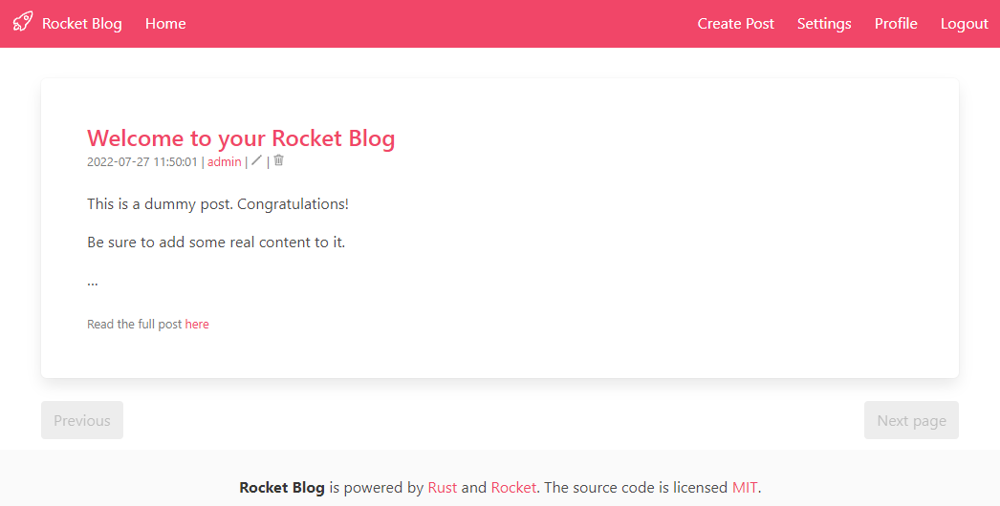

# Rocket Blog
## A blog using Rust and Rocket.rs

This is a simple blog written in Rust and using the [Rocket.rs](https://rocket.rs) framework for educational purpose only. It is not meant to be used in production.
It's using a file-based database for storing the blog posts and the users. This might be a potential security risk.

## Running the blog
Rocket.rs makes use of unstable features, therefore you will need to enable the nightly toolchain for this project.
```bash
rustup override set nightly
```
```bash
cargo run
```

## Example
